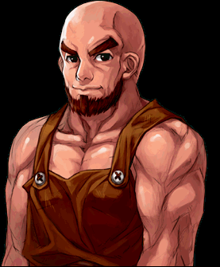
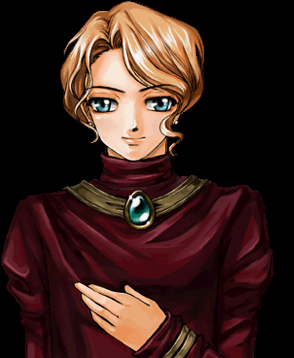
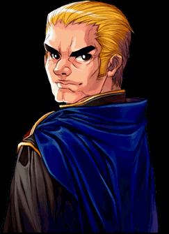
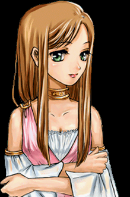

# MetaData

When a client logs into the game, one of the first things it does is request the server's metadata. There are various
kinds of metadata and
each kind will be detailed below. Generation of metadata is handled by
the [MetaDataCache](<xref:Chaos.Services.Storage.MetaDataCache>) class. Configuration for this class can be specified
via `Options:MetaDataCacheOptions`.

## MetaDataCacheOptions

The `MetaDataCacheOptions` class contains configuration for the `MetaDataCache` class. The following properties are
available:  
[!code-csharp]

### Mutators

Mutators are used to modify Item metadata before it is finalized. For example, if you implement a system in your server
for enchanting
items, the enchanted items would not be completely new items. You could achieve those enchantments by setting the values
on Item.cs and
letting them serialize as overrides to the template values. To have these items show up in metadata, you would create a
mutator that
simulates enchantments through non-destructive mutation of an item meta node.

Implement your own mutator as implementations of
the [IMetaNodeMutator](<xref:Chaos.Services.Storage.Abstractions.IMetaNodeMutator`1>) interface and add it to
the `MetaDataCacheOptions` via the `Chaos.Services.Configuration.OptionsConfigurer`

### Example

Here is an example of a mutator that generates mutations of items similarly to the original enchantment system.

[!code-csharp]

This mutator is then added to the `MetaDataCacheOptions` in `Chaos.Services.Configuration.OptionsConfigurer`

[!code-csharp]

> [!NOTE]
> You can have both Prefix and Suffix mutators. When metadata is generated, it will create a cross product of all prefix
> and suffix
> mutations

## Item MetaData

Item metadata is shown when a player hovers over an item in a shop or the bank. Item metadata is pulled from the details
in
the `ItemTemplate`s that you have already created.

### Item MetaData Mapping

| Meta Property | ItemTemplate Property | Notes                                                                                                      |
|---------------|-----------------------|------------------------------------------------------------------------------------------------------------|
| Name          | Name                  | The name of the item                                                                                       |
| Level         | Level                 | The level required to equip the item  If no level is specified, metadata is displayed as "no limit"    |
| Class         | Class                 | The class required to equip the item  If no class is specified, metadata is displayed as "all classes" |
| Weight        | Weight                | The weight of the item                                                                                     |
| Category      | Category              | The name of the tab the item appears under when displayed in a shop or the bank                            |
| Description   | Description           | A short description of the item. This will show under "Features" in shop and bank windows                  |

## Ability MetaData

Ability metadata is shown per-class in the character's profile under the `Skills` tab. Ability metadata is pulled from
the details in
the `SkillTemplate`s and `SpellTemplate`s that you have already created. Each `SClass` metadata file is for a specific
class. They follow
the pattern laid out in the [Class](<xref:Chaos.Common.Definitions.BaseClass>) enum.  
For example, the `SClass1` metadata file is for the Warrior class.  
The `SClass2` metadata file is for the Rogue class.

### Ability MetaData Mapping

| Meta Property  | ItemTemplate Property | Notes                                                    |
|----------------|-----------------------|----------------------------------------------------------|
| IconId         | PanelSprite           | The icon of the ability                                  |
| Name           | Name                  | The name of the ability                                  |
| Level          | Level                 | The level requires to learn the ability                  |
| RequiresMaster | RequiresMaster        | Whether or not you must be a master to learn the ability |
| Ability        | -                     | TODO                                                     |
| PreReq1Name    | LearningRequirements  | The name of a prerequisite skill or spell                |
| PreReq1Level   | -                     |                                                          |
| PreReq2Name    | LearningRequirements  | The name of a prerequisite skill or spell                |
| PreReq2Level   | -                     |                                                          |
| Str            | LearningRequirements  | The STR required to learn the ability                    |
| Int            | LearningRequirements  | The INT required to learn the ability                    |
| Wis            | LearningRequirements  | The WIS required to learn the ability                    |
| Con            | LearningRequirements  | The CON required to learn the ability                    |
| Dex            | LearningRequirements  | The DEX required to learn the ability                    |
| Description    | Description           | A brief description of the ability                       |

## Event MetaData

Event metadata appears in the character's profile under the `Events` tab. It is a list of events a player can complete,
along with details
about those events. These events can be in one of 3 states, unavailable, available, or completed. Here are the
requirements for an event to
be in each state:

### Unavailable (gray with a crossed out circle)

* The criteria for available are not met
* If the character is a master, all events before circle 6 will be unavailable
* If the character has an Advanced Class, all events before circle 7 will be unavailable

### Available (blue with an exclamation mark)

* The character must be at a level within the designated Circle
* The character must be one of the classes the quest is available to

### Completed (green check mark)

* The character must have a legend mark with a key equal to the id of the event

Since no objects directly correlate to events, the metadata must be specified directly
through [EventMetaSchema](<xref:Chaos.Schemas.MetaData.EventMetaSchema>).

This file is located at `StagingDir/MetaData/Events.json` by default

### EventMetaSchema Properties

| Type                                                                       | Name                | Description                                                                                                                                                                     |
|----------------------------------------------------------------------------|---------------------|---------------------------------------------------------------------------------------------------------------------------------------------------------------------------------|
| string                                                                     | Id                  | A unique id specific to this event. In order for the event to show up as completed, a legend mark with a key equal to this Id must be given                                     |
| string                                                                     | Title               | The title of the event                                                                                                                                                          |
| int?                                                                       | PageOverride        | Default null If set, this is the page that the event will show up on(starting at index of 1). If null, the page will be determined by the event's lowest qualifying circle |
| ICollection\<[LevelCircle](<xref:Chaos.Common.Definitions.LevelCircle>)\>? | QualifyingCircles   | Default null if set, these are the circles this quest is available to. If null, the event will be available to all circles                                                 |
| ICollection\<[BaseClass](<xref:Chaos.Common.Definitions.BaseClass>)\>?     | QualifyingClasses   | Default null If set, these are the classes this event is available to. If null, the event will be available to all classes                                            |
| string?                                                                    | PrerequisiteEventId | The id of the event that must be completed before this event can be completed. This event will only show up blue(available) if the previous event was completed                 |
| string                                                                     | Summary             | A brief summary of the event                                                                                                                                                    |
| string?                                                                    | Rewards             | Default null. The rewards given when the event is completed                                                                                                                |
| string                                                                     | Result              | When the event is completed, the event will be marked green(completed) and show this text in place of it's summary                                                              |

### Example json

[!code-json]

## Nation Description MetaData

Nation description metadata is used to display the description of a nation in the character's profile.
the [Nation](<xref:Chaos.Common.Definitions.Nation>) enum technically only controls the emblem that is displayed on the
profile. The words
next to it are controlled by the nation description metadata. This metadata is automatically generated from
the [Nation](<xref:Chaos.Common.Definitions.Nation>) enum.

### Nation MetaData Mapping

The nation enum is mapped by it's number and name. For example, `Nation.Suomi` is mapped so that the description of the
emblem for that
number is "Suomi".

## Mundane Illustration MetaData

Mundane illustration metadata is used by the client to determine which full art illustrations to display for mundanes,
if any. This metadata
must be specified directly
through [MundaneIllustrationMetaSchema](<xref:Chaos.Schemas.MetaData.MundaneIllustrationMetaSchema>).

This file is located at `StagingDir/MetaData/MundaneIllustrations.json` by default

See [below](#illustrations) for a list of possible illustrations

### Example json

[!code-json]

### Illustrations

bank.spf   
      
black.spf  
     
boy.spf  
  
buls.spf  
      
ed.spf  
        
ed1.spf  
       
girl.spf  
      
girl2.spf  
  
helper.spf  
  
hof.spf  
  
ia.spf  
  
inn.spf  
  
kan.spf  
  
kan2.spf  
  
knight.spf  
  
knight1.spf  
  
lady.spf  
  
mage.spf  
  
man1.spf  
  
metus.spf  
  
murkhan.spf  
  
nori.spf  
  
rho.spf  
  
rose.spf  
  
rose1.spf  
  
rose2.spf  
  
saser.spf  
  
saser1.spf  
  
seaus.spf  
  
seba.spf  
  
seoj.spf  
  
setoa.spf  
  
shaman.spf  
  
spskill.spf  
  
west1.spf  
  
white.spf  
  